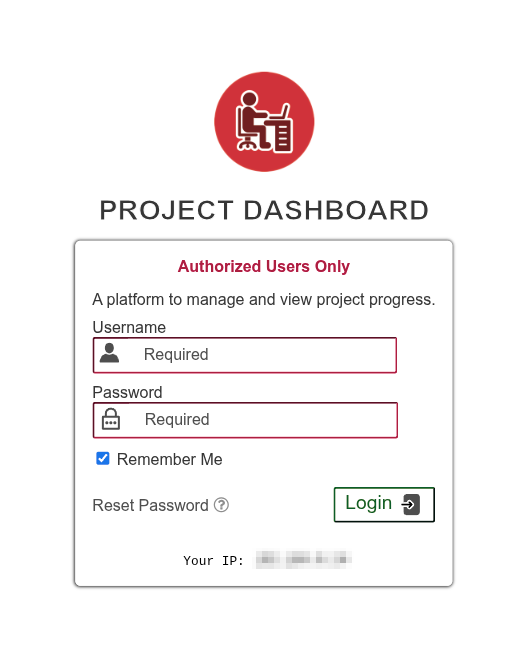
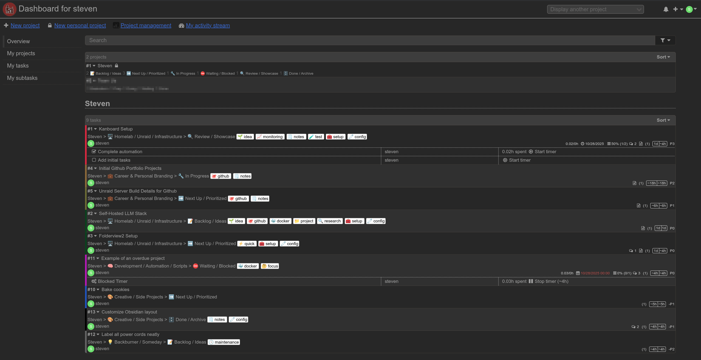
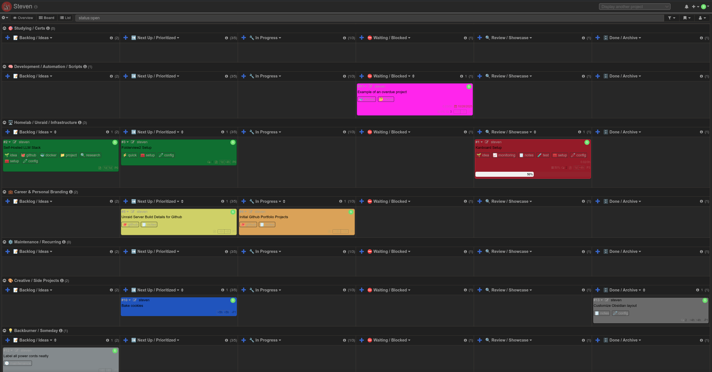
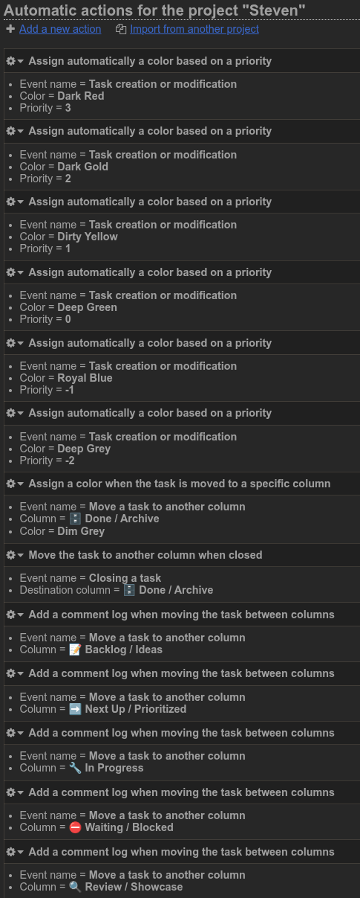
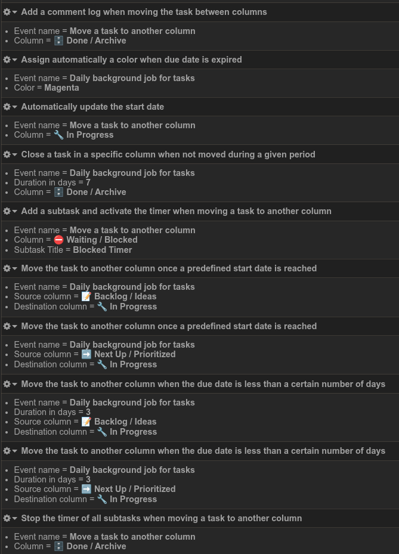
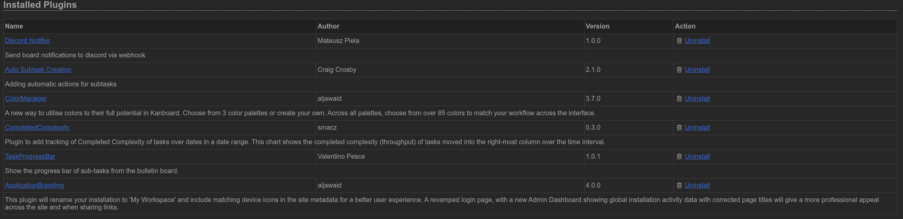
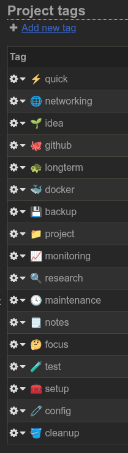

# 🧩 Project: Kanboard Workflow Manager

### 🗓️ Created: 2025-10-30  🆙 Last Updated: 2025-11-05  📈 Status: ✅ Completed

> A self-hosted Kanban board built with [Kanboard](https://github.com/kanboard/kanboard), featuring automated task management, color-coded priorities, and Discord webhook integration. 

---
### 🎯 Reason for This Project

This was a much needed project. Previously, I was using note-taking applications like [Obsidian](http://www.obsidian.md) to track my tasks, but that has become cumbersome for tracking progress, due dates, and task priorities.

---

### 🥅 Goals

- ✅ **Find a system that actually fits in with my personal workflow.**
- ✅ **Set up multi-user access so my family can track chores and projects.**
- ✅ **Host it myself for full control and privacy.**
- ✅ **Connect it to my Tailscale network for secure remote access.**
- ✅ **Build swimlanes for Homelab, Study, Career, and Personal tasks.**
- ✅ **Create a clean workflow: Backlog → Up Next → In Progress → Waiting → Review → Complete.**
- ✅ **Use color-coded priorities (-2 to 3) for quick visual urgency checks.**  
    _Implemented through automation rules and the [ColorManager](https://github.com/aljawaid/ColorManager) plugin._
- ✅ **Automate task color, comments, and status updates with event rules and daily cron jobs.**
- ✅ **Add automatic start dates, timers, comments, auto-closing, and archiving for task lifecycle management.**
- ✅ **Design a consistent tag system with unique emojis for filtering and organization.**
- ❌ **Reopen closed tasks automatically when moved out of the "Done / Archive" column.**   
    _Not supported within Kanboard._
- ❌ **Auto-adjust priority of closed tasks to -2 for better sorting by priority on the dashboard.**   
    _Not supported within Kanboard._
- ❌ **Create a public/demo board for portfolio viewing.**  
    _Keeping private to avoid exposing personal data. This board will stay private for long-term use. I may create a clone in the future to demo._

---

### 🧾 Outcome

Kanboard is now running as my full-time task management system, hosted on my Unraid server and accessible anywhere securely via [Tailscale](https://tailscale.com). The workflow is simple, clean, and almost completely automated.

Task colors update automatically based on priority changes and due dates. 
Tasks moved to the “Done / Archive” column change to a dark gray color, and after seven days they are automatically closed. This prevents buildup while keeping a clear visual record of progress. 
Overdue tasks turn bright magenta to stand out and signal urgent attention.

A tagging system with unique emojis allows for quick searching and filtering.  
Work-in-progress limits ensure focus by capping how many tasks can be "Next Up" or "In Progress."

Kanboard also sends real-time updates to my private Discord server via webhooks whenever tasks are created, updated, or completed.

It’s secure, stable, fast, and most importantly does not rely on any cloud services or share my private information with large companies. It’s simple, visual, self-maintaining, and it just works.

This completely replaces my old Obsidian task setup, letting Obsidian return to what it does best: note-taking.

---

### 🧠 What I Learned

- How the Kanban system works and how to use a board effectively for personal projects.  
- How to set up automation in Kanboard and how rule order impacts behavior.  
- How to chain automation together to create more complex behavior.  
- Which plugins were necessary to meet certain goals and improve quality of life.  
- How to trigger Discord webhooks for live task updates. (I already use Discord heavily for homelab notifications, bots, and monitoring.)  
- How to organize tags and priorities to add structure without over complicating the workflow.  
- That simplicity and automation save far more time than micromanaging individual tasks.  

---

### 🛠️ What I Did

- Set up Kanboard as a docker container on my Unraid server with persistent storage.
- Configured encrypted access through my Tailscale network for secure remote use.
- Installed and configured plugins including [Discord Notifier](https://github.com/mateuszpiela/kanboard-discordnotifierplugin), [Auto Subtask Creation](https://github.com/creecros/AutoSubtasks), [ColorManager](https://github.com/aljawaid/ColorManager), [CompletedComplexity](https://gitlab.com/smacz/kanboard-completedcomplexity), and [ApplicationBranding](https://github.com/aljawaid/ApplicationBranding).
- Created swimlanes and columns to match my preferred workflow methodology, and to improve organization.
- Built automation rules for task colors, timers, and auto-closing completed tasks after 7 days.
- Configured daily cron jobs to update task colors for lapsed due dates, and enforce automation rules.
- Designed a consistent tagging system with unique emojis to allow quick filtering.
- Documented the configuration and workflow here for future reference if needed.

---

### ⚔️ What I Struggled With

- **Kanboard doesn’t support reordering automations or swimlanes.** I had to delete and recreate rules and swimlanes multiple times to get the correct final order I wanted.
- Some automation combinations conflicted at first (like priority color rules overriding overdue color rules). Fixing it required careful ordering.
- There’s no built-in way, or plugin for the latest version to reopen tasks when they are moved out of a column. I think a plugin could fix it in the future?
- Auto-assigning priorities when moving tasks between columns isn’t supported. It would make dashboard sorting cleaner but isn’t critical.
- Tags cannot be rearranged manually to make sense, it seems to be done automatically and with emojis, they are shuffled in weird ways.

All of these were minor friction points, not dealbreakers. The end result functions as I envisioned.

---

### 📸 Screenshots / Results
Below are screenshots showing the final workflow and configuration.

#### 🔐 Login
Kanboard’s login screen, themed with the ApplicationBranding plugin.  

#### 🏠 Dashboard
An overview of the different project boards and assigned tasks, can be sorted in different ways.  

#### 📋 Kanboard Project
The main page within the project. Allows you to view, create, and manage tasks easily.  

#### ⚙️ Automation Rules
My automation configuration for task colors, due date warnings, and auto-closing behavior.  

#### 🔌 Plugins
Installed Kanboard plugins that increase functionality and alter the vanilla view.  

#### 🏷️ Tags
Custom tags for quick filtering and grouping of tasks.  

---

### 🔁 What I’d Do Differently

- Plan the automation logic before creating it to prevent rework due to the inability to reorder rules.
- Write a simple setup guide while building to make replication or recovery easier if necessary.

---

### 🪞 Personal Reflection

This project ended up being much more valuable than I initially expected it to be. I did not anticipate automation within a Kanban board, but it made all the difference in allowing me to focus on tasks instead of focusing on Kanboard. 

It also reinforces my belief that a good system is a simple system. Complexity has its place, but the front end should be simple and easy to use. The less the user needs to manually do, the more real work or projects can be completed. I will continue to uphold this belief in my other projects, and in my work.

I think everyone should incorporate some sort of task tracking system that fits their lifestyle and workflow preferences. I can imagine the average household would benefit tremendously from a centralized task board with clear visual feedback of activities, chores, etc.

---
### 🧱 Changelog

| Date | Change | Notes |
|------|---------|-------|
| 2025-10-29 | Began project | Spun up Kanboard as a Docker container |
| 2025-10-30 | Initial setup and testing complete | Finished my primary Kanboard setup with automations, plugins, etc |
| 2025-10-30 | Created project writeup in Obsidian | Created draft to review before git push |
| 2025-11-05 | Fixed formatting in README | |

---

### 🗂️ Related Links

- **[My Portfolio](https://github.com/StevenKearney/portfolio)**
- **[Kanboard Documentation](https://docs.kanboard.org/)**

